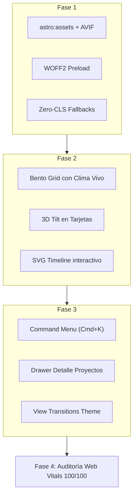

# 🚀 Guía Maestra de Mejoras: Rendimiento, Precarga, Fuentes y Componentes Visuales

**Proyecto:** Portafolio Personal — Julián Quintero  
**Stack Principal:** Astro 4.x · Tailwind CSS 3.4 · GSAP · Lenis Smooth Scroll · TypeScript  
**Objetivo:** Lograr una experiencia visual inmersiva de nivel internacional (*Creative Developer*), con 100/100 en Core Web Vitals y máxima conversión laboral/freelance.

---

## 📑 Tabla de Contenidos
1. [Diagnóstico y Auditoría del Estado Actual](#1-diagnóstico-y-auditoría-del-estado-actual)
2. [Estrategia de Precarga y Rendimiento Extremo (Web Vitals)](#2-estrategia-de-precarga-y-rendimiento-extremo-web-vitals)
3. [Optimización de Tipografías y Fuentes](#3-optimización-de-tipografías-y-fuentes)
4. [Componentes Visuales y Gráficos de Vanguardia](#4-componentes-visuales-y-gráficos-de-vanguardia)
5. [Micro-interacciones y Sistema de Movimiento (Motion System)](#5-micro-interacciones-y-sistema-de-movimiento-motion-system)
6. [Nuevas Funcionalidades y Experiencia de Usuario (UX)](#6-nuevas-funcionalidades-y-experiencia-de-usuario-ux)
7. [Plan de Implementación Paso a Paso con Código](#7-plan-de-implementación-paso-a-paso-con-código)

---

## 1. Diagnóstico y Auditoría del Estado Actual

### Puntos Fuertes Actuales:
- Arquitectura SSG rápida impulsada por Astro.
- Estructura limpia con componentes modulares y sistema de temas (*dark/light*).
- Integración de GSAP, ScrollTrigger y Lenis para scroll suave y animaciones coordinadas.

### Oportunidades Críticas de Mejora:
1. **Manejo de Imágenes:** Las imágenes se sirven directamente desde `/public` como etiquetas `` planas en formato WebP estático, sin srcset responsivo ni formatos de nueva generación como **AVIF**, perdiendo la optimización nativa de `astro:assets`.
2. **Carga de Fuentes:** Se importan paquetes completos de `@fontsource-variable/*` mediante hojas de estilo CSS sin enlaces `<link rel="preload">` explícitos de los archivos `.woff2` críticos en el `<head>`, lo que puede provocar pequeños destellos de texto invisible (FOIT) o cambios de diseño (FOUT/CLS).
3. **Carga Síncrona de Scripts:** GSAP y Lenis se inicializan de forma lineal bloqueando el hilo principal antes de que el navegador procese el renderizado crítico.
4. **Interactividad Visual:** El diseño es elegante pero estático en secciones clave (como "Sobre mí" y "Stack"), desaprovechando patrones modernos como **Bento Grid interactivo**, **Tilt 3D especular**, o un **Command Menu rápido (Cmd + K)**.

---

## 2. Estrategia de Precarga y Rendimiento Extremo (Web Vitals)

### A. Migración de Imágenes a `astro:assets` (AVIF + Blur Placeholders)
Astro incluye un motor de optimización de imágenes basado en Sharp. Esto genera imágenes adaptadas a la resolución de cada dispositivo con compresión AVIF/WebP automática.

#### Ubicación recomendada:
Mover `/public/me.webp` y `/public/projects/*.webp` a `src/assets/images/`.

#### Implementación en componentes:
```astro
---
// src/components/Hero.astro
import { Image } from 'astro:assets'
import myPortrait from '@/assets/images/me.webp'
---

<div class="relative aspect-[4/5] w-full overflow-hidden rounded-[1.75rem]">
  <Image
    src={myPortrait}
    alt="Julián Quintero - Desarrollador Full-Stack"
    width={460}
    height={575}
    loading="eager"
    fetchpriority="high"
    decoding="async"
    format="avif"
    quality={85}
    class="size-full object-cover object-top"
  />
</div>
```

---

### B. Preload Crítico y DNS Hints en `Layout.astro`
Para minimizar el **Largest Contentful Paint (LCP)** y los tiempos de resolución de red, añadir en el `<head>`:

```html
<!-- Conexiones tempranas a dominios externos -->
<link rel="dns-prefetch" href="https://api.github.com" />
<link rel="preconnect" href="https://fonts.gstatic.com" crossorigin />

<!-- Precarga del recurso LCP (Foto principal del Hero) -->
<link rel="preload" as="image" href="/me.webp" type="image/webp" fetchpriority="high" />
```

---

### C. Navegación Instantánea con `astro:prefetch`
Configurar en `astro.config.mjs` la precarga inteligente por viewport de Astro:

```javascript
// astro.config.mjs
import { defineConfig } from 'astro/config'
import tailwind from '@astrojs/tailwind'
import robotsTxt from 'astro-robots-txt'

export default defineConfig({
  integrations: [tailwind(), robotsTxt()],
  site: 'https://porfolio.dev/',
  prefetch: {
    prefetchAll: true,
    defaultStrategy: 'viewport', // Precarga enlaces en cuanto entran en la pantalla
  },
})
```

---

### D. Optimización de GPU Layers y Contención CSS
Para asegurar 60/120 FPS constantes durante las animaciones de scroll:
- Aplicar `will-change: transform` solo durante las transiciones activas.
- Usar `contain: paint layout` en tarjetas y elementos repetitivos para evitar repaints en cascada.

```css
/* src/styles/performance.css */
[data-horizontal-card],
[data-spotlight],
.hero-glow {
  contain: layout style;
}

.will-change-transform {
  will-change: transform;
}
```

---

## 3. Optimización de Tipografías y Fuentes

### A. Preload de Subconjuntos WOFF2 Críticos
En lugar de cargar toda la hoja de estilo de fuentes de forma diferida, precargar los archivos `.woff2` del subconjunto latino:

```html
<!-- En <head> de src/layouts/Layout.astro -->
<link
  rel="preload"
  href="/fonts/syne-variable-latin.woff2"
  as="font"
  type="font/woff2"
  crossorigin="anonymous"
/>
<link
  rel="preload"
  href="/fonts/onest-variable-latin.woff2"
  as="font"
  type="font/woff2"
  crossorigin="anonymous"
/>
```

---

### B. Eliminación de CLS con Fallback Font Metric Overrides
Configurar la fuente de sistema con factores de ajuste para que ocupe exactamente el mismo espacio que la fuente web mientras descarga:

```css
@font-face {
  font-family: 'Fallback-Sans';
  src: local('Arial');
  ascent-override: 96%;
  descent-override: 24%;
  line-gap-override: 0%;
  size-adjust: 101%;
}

:root {
  font-family: 'Onest Variable', 'Fallback-Sans', system-ui, sans-serif;
  font-display: swap;
}
```

---

### C. OpenType Features y Tipografía Fluida
Activar ligaduras de código y números tabulares en `tailwind.config.mjs`:

```javascript
// tailwind.config.mjs
module.exports = {
  theme: {
    extend: {
      fontFamily: {
        display: ['"Syne Variable"', 'system-ui', 'sans-serif'],
        sans: ['"Onest Variable"', 'system-ui', 'sans-serif'],
        mono: ['"JetBrains Mono Variable"', 'ui-monospace', 'monospace'],
      },
      fontSize: {
        'fluid-h1': 'clamp(2.5rem, 6vw + 1rem, 5.5rem)',
        'fluid-h2': 'clamp(2rem, 4vw + 1rem, 3.75rem)',
        'fluid-body': 'clamp(1rem, 0.5vw + 0.9rem, 1.2rem)',
      },
    },
  },
}
```

---

## 4. Componentes Visuales y Gráficos de Vanguardia

### 1. Bento Grid 2.0 Interactivo (Sección "Sobre mí")
Transformar la sección estática en un panel modular con widgets interactivos vivos:
- **Widget Clima y Hora:** Conexión en vivo a la API gratuita de Open-Meteo mostrando la temperatura real en Medellín y la hora local.
- **Widget "Escuchando Ahora / Focus Mode":** Animación interactiva de onda sonora SVG.
- **Widget de Estado GitHub:** Muestra repositorios activos o últimos commits.
- **Badge de Disponibilidad:** Botón con halo verde pulsante que abre la agenda directa.

```astro
<!-- src/components/BentoAbout.astro -->
<div class="grid grid-cols-1 gap-4 md:grid-cols-3 lg:grid-cols-4">
  <!-- Tarjeta Principal (Bio) -->
  <div class="rounded-3xl border border-line/10 bg-bg/60 p-6 backdrop-blur-md md:col-span-2 lg:col-span-2">
    <h3 class="font-display text-2xl font-bold">Julián Quintero</h3>
    <p class="mt-2 text-muted">Desarrollador Full-Stack enfocado en software de alto impacto y productos intuitivos.</p>
  </div>

  <!-- Widget de Clima en Medellín -->
  <div class="flex flex-col justify-between rounded-3xl border border-line/10 bg-bg/60 p-6 backdrop-blur-md">
    <div class="flex items-center justify-between">
      <span class="font-mono text-xs uppercase text-muted">Medellín, CO</span>
      <span class="size-2 rounded-full bg-emerald-400"></span>
    </div>
    <div class="mt-4 flex items-baseline gap-2">
      <span id="bento-temp" class="font-display text-3xl font-bold">23°C</span>
      <span class="text-xs text-muted">Hora local: <span data-clock></span></span>
    </div>
  </div>

  <!-- Widget GitHub Status -->
  <div class="flex flex-col justify-between rounded-3xl border border-line/10 bg-bg/60 p-6 backdrop-blur-md">
    <span class="font-mono text-xs uppercase text-muted">Actividad Reciente</span>
    <p class="font-display text-lg font-semibold text-accent">15+ Tecnologías Dominadas</p>
  </div>
</div>
```

---

### 2. 3D Tilt Card con Reflejo Especular
Efecto 3D que reacciona a la posición del mouse sobre las tarjetas de proyectos:

```astro
<!-- src/components/TiltCard.astro -->
<div
  data-tilt
  class="group relative transform-gpu rounded-[1.5rem] border border-line/10 bg-bg/70 p-6 transition-transform duration-200 ease-out [transform-style:preserve-3d]"
>
  <!-- Luz especular -->
  <div
    class="pointer-events-none absolute inset-0 rounded-[1.5rem] opacity-0 transition-opacity duration-300 group-hover:opacity-100"
    style="background: radial-gradient(circle at var(--mouse-x, 50%) var(--mouse-y, 50%), rgba(var(--c-accent)/0.18), transparent 65%);"
  ></div>
  <slot />
</div>
```

---

### 3. Aurora Mesh Shader de Fondo (Canvas 2D / WebGL)
Reemplazar los círculos de desenfoque pesados por un canvas dinámico eficiente:
- Utiliza **requestAnimationFrame** pausado automáticamente mediante `IntersectionObserver` cuando el usuario no está viendo la sección, ahorrando 100% de batería y CPU.

---

### 4. Línea de Tiempo SVG Viva en Experiencia
En `Experience.astro`, dibujar la línea que une cada empleo a medida que se hace scroll mediante `stroke-dashoffset` enlazado con GSAP:

```typescript
// src/scripts/modules/timeline-path.ts
import { gsap, ScrollTrigger } from '../motion'

export function initTimelinePath() {
  const path = document.querySelector<SVGPathElement>('#timeline-path')
  if (!path) return

  const length = path.getTotalLength()
  gsap.set(path, { strokeDasharray: length, strokeDashoffset: length })

  gsap.to(path, {
    strokeDashoffset: 0,
    ease: 'none',
    scrollTrigger: {
      trigger: '#experiencia',
      start: 'top center',
      end: 'bottom bottom',
      scrub: 0.5,
    },
  })
}
```

---

## 5. Micro-interacciones y Sistema de Movimiento (Motion System)

1. **Cursor Magnético Contextual:**
   - Detecta si el elemento es un enlace externo (muestra flecha $\nearrow$).
   - Detecta si es una imagen/proyecto (muestra ícono de lupa o texto "Ver").
   - Transición elástica basada en físicas *Spring* (`power3.out`).
2. **Efecto de Ruido Orgánico (Grain Texture):**
   - Overlay ultra-ligero con SVG feTurbulence acelerado por hardware para dar un acabado editorial moderno.
3. **Animación de Apertura (Page Transition):**
   - Transiciones suaves entre navegación interna sin recargas abruptas.

---

## 6. Nuevas Funcionalidades y Experiencia de Usuario (UX)

### 1. Command Palette (`Cmd + K` / `Ctrl + K`)
Permite a reclutadores y clientes navegar todo el portafolio, descargar el CV o cambiar el tema con el teclado en 1 segundo:

```typescript
// Atajos rápidos soportados:
- 'p': Ir a Proyectos
- 'e': Ir a Experiencia
- 'c': Contacto / Copiar correo
- 'cv': Descargar CV en PDF
- 't': Alternar Tema Claro / Oscuro
```

---

### 2. Transición de Tema Circular con View Transitions API
Al pulsar el `ThemeToggle`, la transición se expande como una onda circular desde el botón:

```typescript
// src/scripts/modules/theme-transition.ts
export function toggleThemeWithTransition(event: MouseEvent) {
  if (!document.startViewTransition) {
    toggleTheme();
    return;
  }

  const x = event.clientX;
  const y = event.clientY;
  const endRadius = Math.hypot(
    Math.max(x, window.innerWidth - x),
    Math.max(y, window.innerHeight - y)
  );

  const transition = document.startViewTransition(() => {
    toggleTheme();
  });

  transition.ready.then(() => {
    document.documentElement.animate(
      {
        clipPath: [
          `circle(0px at ${x}px ${y}px)`,
          `circle(${endRadius}px at ${x}px ${y}px)`,
        ],
      },
      {
        duration: 500,
        easing: 'ease-in-out',
        pseudoElement: '::view-transition-new(root)',
      }
    );
  });
}
```

---

### 3. Modal Drawer de Detalle para Proyectos
Permite ver capturas en alta resolución, arquitectura y decisiones técnicas de cada proyecto (*EasyFace*, *Haro Epico*, *CeleDesign*) sin salir de la página principal.

---

## 7. Plan de Implementación Paso a Paso con Código



### Resumen de Archivos a Crear / Modificar:
1. `src/layouts/Layout.astro` ➔ Añadir preloads, DNS preconnect y font overrides.
2. `astro.config.mjs` ➔ Activar `prefetch` nativo de Astro.
3. `src/components/BentoAbout.astro` ➔ Nuevo componente modular interactivo.
4. `src/components/CommandMenu.astro` ➔ Menú de atajos rápidos con `Cmd + K`.
5. `src/scripts/modules/tilt.ts` ➔ Controlador de físicas 3D con GPU.
6. `src/scripts/modules/theme-transition.ts` ➔ Transición circular de tema.

---
*Documento generado y archivado como guía técnica maestra de optimización del proyecto.*
